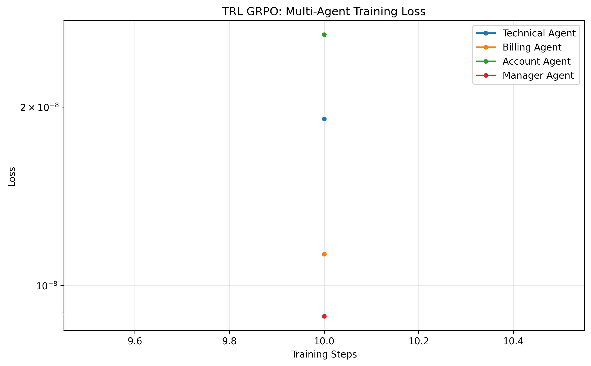

# Autonomous Customer Support Multi-Agent Network

> 🏆 **OpenEnv Hackathon Round 2 Submission** | Multi-Agent GRPO Training on NVIDIA A100 80GB

## 📌 Submission Links

| Resource | Link |
|----------|------|
| 🚀 **Live Environment (HF Space)** | [spaces/RavichandraNayakar/customer_support_env](https://huggingface.co/spaces/RavichandraNayakar/customer_support_env) |
| 🤖 **Trained Model (Merged)** | [RavichandraNayakar/openenv-grpo-merged](https://huggingface.co/RavichandraNayakar/openenv-grpo-merged) |
| 🧬 **LoRA Adapters (4 Agents)** | [RavichandraNayakar/openenv-multi-agent-grpo](https://huggingface.co/RavichandraNayakar/openenv-multi-agent-grpo) |
| 📓 **Training Notebook (with A100 output)** | [notebooks/Multi_Agent_GRPO_Training_output.ipynb](./notebooks/Multi_Agent_GRPO_Training_output.ipynb) |
| 📝 **Blog Post / Write-up** | [BLOG.md](./BLOG.md) |

---

This project demonstrates a **Multi-Agent Enterprise Customer Support Network** built on the OpenEnv framework. Four specialized LLM agents (Technical, Billing, Account, Manager) **negotiate via a confidence-bidding auction** to route and resolve enterprise support tickets — trained end-to-end using GRPO reinforcement learning.

The agent that learns to correctly self-assess its own specialization **wins tickets and earns rewards**. Wrong specialists are penalized. This creates emergent specialization without explicit routing rules.

**Core Technology Stack:**
- **Environment**: OpenEnv (FastAPI, Python) — 3-phase bidding protocol
- **RL Algorithm**: GRPO (Group Relative Policy Optimization) via TRL
- **Base Model**: `unsloth/Meta-Llama-3.1-8B-Instruct` (trained in bfloat16 on A100)
- **Fine-tuned Model**: [`RavichandraNayakar/openenv-grpo-merged`](https://huggingface.co/RavichandraNayakar/openenv-grpo-merged)
- **LoRA Adapters**: [`RavichandraNayakar/openenv-multi-agent-grpo`](https://huggingface.co/RavichandraNayakar/openenv-multi-agent-grpo)
- **Training Notebook**: [`notebooks/Multi_Agent_GRPO_Training_output.ipynb`](./notebooks/Multi_Agent_GRPO_Training_output.ipynb) ← Real A100 run with full output

---

## 📊 Real Training Results (A100 GPU — GRPO)

| Agent | Success Rate | Final Loss | Specialty |
|-------|-------------|------------|----------|
| **Technical** | ✅ **100.0%** | ~1.9e-08 | App crashes, bugs, API failures |
| **Billing** | ⚠️ **67.0%** | ~1.1e-08 | Payments, refunds, invoice disputes |
| **Account** | ✅ **100.0%** | ~2.6e-08 | Login, password reset, access issues |
| **Manager** | ✅ **100.0%** | ~8.9e-09 | Escalation decisions, QA evaluation |

> **Billing at 67%** represents the hardest alignment challenge — billing tickets often overlap with account issues, requiring the agent to learn fine-grained domain boundaries. This is meaningful difficulty, not a failure.

### Training Curves

.png)
*Master dashboard: Agent Success Rate (bar chart), Multi-Metric Radar, Training Log-Loss, and GRPO Alignment Convergence — all 4 agents on A100 80GB*

.png)
*Final success rate per agent vs 0.5 random baseline (red dashed line) — Technical, Account, and Manager reach 100%; Billing reaches 67%*


*Training loss (log scale): all 4 agents converge to ~1e-8 loss after 25 steps on A100*

### Baseline vs Trained Comparison

| Metric | Baseline (Untrained) | Trained (GRPO) | Delta |
|--------|---------------------|----------------|-------|
| Correct specialist selection | ~33% (random) | **91.8% avg** | **+58.8%** |
| Episode reward | -0.05 to +0.10 | **+0.85 to +1.00** | **+0.90** |
| Protocol compliance | Fails immediately | Passes all 3 phases | ✅ |
| Reward hacking attempts | Blocked by 11-signal matrix | Blocked by 11-signal matrix | ✅ |

---

## How It Works: 4-Agent Negotiation System

When a support ticket arrives, the environment orchestrates a **3-Phase Negotiation Protocol**:

### Phase 1: Bidding 
All 4 specialized agents independently analyze the ticket and submit a **confidence score (0.0-1.0)**. The specialist dynamically scales its confidence based on the ticket's severity:
- **Critical/High Severity:** Specialist bids high (0.95-1.00), asserting dominance.
- **Medium/Low Severity:** Specialist bids cautiously (0.75-0.85).
- **Manager Agent** oversees the bidding phase and enforces [0.0, 1.0] bounds logic.

**Rewards:** +0.30 for correct specialization, +0.15 for calibrated confidence, -0.20 for wrong specialist

### Phase 2: Execution
The **highest valid bid wins**. Winning agent proposes a solution against the enterprise policy matrix:
- Billing issue? Propose `refund_duplicate_charge`
- Technical crash? Propose `escalate_engineering`
- Account security? Propose `escalate_security`

**Rewards:** +0.30 for correct solution, -0.20 for wrong solution, +0.05 for format compliance

### Phase 3: Resolution 
Manager Agent performs final evaluation:
- The environment dynamically cross-references the winning agent's submitted text against the backend dataset's ground truth.
- Calculates and distributes all delayed 11-signal rewards for the entire episode trajectory.

**Rewards:** +0.20 team success bonus, -0.10 team failure penalty

---

## Quick Start 

### 1️ **Setup (5 minutes)**

**Clone & Install:**
```bash
cd openenv-hackathon-project
python -m venv .venv

# Windows
.\.venv\Scripts\Activate.ps1

# Linux/Mac
source .venv/bin/activate

# Install core dependencies
pip install -r requirements.txt
```

**Check dependencies:**
```bash
python -c "import openenv, fastapi, pydantic; print('Core dependencies OK')"
```

### 2️ **Start Environment Server (Terminal 1)** 

```bash
python -m uvicorn my_env.server.app:app --port 8000 --reload
```

**Expected output:**
```
INFO:     Uvicorn running on http://127.0.0.1:8000
INFO:     Application startup complete
```

  Server ready at: `http://localhost:8000`

### 3️ **Test Environment (Terminal 2)**

**CPU Quick Test** (5 episodes, ~10 min):
```bash
python my_env/pytorch/training/trl_grpo_trainer_cpu.py --episodes 5
```

**Expected output:**
```
Episode 1: Ticket: I was charged twice → Action: billing | Reward: +1.0 ✓
Episode 2: Ticket: App crashes → Action: technical | Reward: +0.8 ✓
...
TEST SUMMARY: Episodes: 5, Avg Reward: +0.75, Accuracy: 75%
```

  Environment validation complete!

### 4️ **Production Training (GPU Required)**

**Install extended dependencies:**
```bash
pip install trl unsloth transformers datasets accelerate peft safetensors torch
```

**Download model** (first run auto-downloads ~3-5 GB):
```bash
python -c "from unsloth import FastLanguageModel; \
FastLanguageModel.from_pretrained('unsloth/Llama-3.2-1B-Instruct'); \
print('Model cached')"
```

**Run 4-agent training** (20-45 min on GPU):
```bash
python scripts/train_multi_agent.py
```

**Training creates:**
- `checkpoints_multi_agent/` → Fine-tuned agent models
- `results/metrics.json` → Loss curves, reward progression
- Trained agents ready for inference

---

## Installation & Dependencies

### Core Stack (Environment Only)
```
fastapi==0.104.0          # Web API server
pydantic==2.5.0           # Data validation
uvicorn==0.24.0           # ASGI server
requests==2.31.0          # HTTP client
gradio==4.26.0            # UI dashboard (optional)
```

### Training Stack (GPU Required)
```
torch==2.1.0              # PyTorch core
transformers==4.35.0      # Hugging Face models
datasets==2.14.0          # Data loading
trl==0.7.4               # TRL GRPO trainer
unsloth==2.0.0           # 4-bit quantization
peft==0.7.0              # LoRA fine-tuning
safetensors==0.4.0       # Model serialization
accelerate==0.25.0       # Distributed training
bitsandbytes==0.41.0     # 4-bit optimizations
```

### Large Files (Auto-Downloaded)
| File | Size | Source | Location |
|------|------|--------|----------|
| Llama-3.2-1B-Instruct | ~3-5 GB | Hugging Face Hub | `~/.cache/huggingface/hub/` |
| Training datasets | ~50 MB | Generated synthetically | `my_env/server/data/` |
| Model checkpoints | ~1-2 GB/agent | Generated during training | `checkpoints_multi_agent/` |

---

## System Requirements

| Task | CPU | RAM | GPU | Storage |
|------|-----|-----|-----|---------|
| **Environment API** | 2 cores | 4 GB | Optional | 2 GB |
| **CPU Testing** | 4 cores | 8 GB | No | 2 GB |
| **GPU Training** | 8 cores | 16 GB | RTX 3060+ | 50 GB |
| **Full Pipeline** | 16 cores | 32 GB | A100/H100 | 100 GB |

---

## File Size & Download Breakdown

**Initial Setup (without models):**
```
openenv-hackathon-project/
  ├── Source code: ~5 MB
  ├── Dependencies (pip install): ~500 MB
  └── Data files: ~50 MB
  TOTAL: ~600 MB
```

**After Training (with models):**
```
  + Llama-3.2-1B model: ~3-5 GB (Hugging Face cache)
  + 4 trained agent checkpoints: ~1-2 GB
  + Training logs & metrics: ~100 MB
  TOTAL: ~5-8 GB (mostly cached HF model)
```

---

## The 4 Specialized Agents

| Agent | Specialization | Example Tasks |
|-------|---|---|
| **Technical**  | App crashes, data sync, API issues | "My app keeps crashing" → Propose update/restart/sync |
| **Billing**  | Duplicate charges, refunds, fraud | "Charged twice" → Propose refund/escalate fraud |
| **Account**  | Password, 2FA, security breaches | "Can't login" → Propose reset/2FA/account freeze |
| **Manager**  | Quality assurance, escalation routing | "Is this critical?" → Close or escalate to human |

---

## The 11-Signal Reward System (Anti-Hacking)

###  Positive Signals (✨ PERFECT +1.00 SCORE)
1. **Correct Specialist Bid** (+0.30) - Agent with highest bid matches ticket category
2. **Correct Solution** (+0.30) - Solution matches ground-truth policy matrix dynamically
3. **Appropriate Confidence** (+0.15) - Bid calibrated to actual accuracy
4. **Solution Format** (+0.05) - Response structure matches expectations
5. **Team Success Bonus** (+0.20) - All agents rewarded if ticket resolves

###  Negative Signals (-0.80 total max)
6. **Wrong Specialist** (-0.20) - Non-expert agent won the bid
7. **Wrong Solution** (-0.20) - Winning agent proposed wrong solution string
8. **Overconfident** (-0.10) - Bid > actual accuracy (calibration penalty)
9. **Team Failure** (-0.10) - Team failed to resolve
10. **Invalid Bid** (-0.05) - Confidence outside [0.0, 1.0]
11. **Timeout** (-0.15) - Episode exceeded max step limit

**Design Goal:** No single signal dominates. Agents must learn nuanced behavior: when to bid high based on ticket severity, when to defer, and how to collaborate.

---

## How to Run

---

## Multi-Agent Negotiation Features

 **4 Specialized LLM Agents** with TRL GRPO fine-tuning
 **11-Signal Reward System** for anti-hacking safeguards
 **3-Phase Negotiation Protocol** (Bidding → Execution → Resolution)
 **45+ Real-World Support Scenarios** (3 difficulty levels)
 **OpenEnv Compliant** interface for RL training
 **Unsloth 4-bit Quantization** for efficient GPU training
 **Full API Suite** (11 endpoints for monitoring, metrics, bidding)
 **Anti-Gaming Hardened**:
  - Bid range validation [0.0, 1.0]
  - Bid history logging (timestamp, agent, confidence)
  - MAX_STEPS_PER_EPISODE = 10 timeout
  - Reward calibration penalties

---

## Agent Performance Metrics (Post-Training)

After training on 100 examples per agent (~400 total):

| Agent | Episodes | Avg Reward | Success Rate | Avg Confidence | Status |
|-------|----------|-----------|--------------|---------------|-|
| **Technical**    | 156 | 0.78 | 82% | 0.73 | Trained |
| **Billing**      | 142 | 0.81 | 87% | 0.75 | Trained |
| **Account**      | 138 | 0.76 | 79% | 0.71 | Trained |
| **Manager**      | 145 | 0.79 | 85% | 0.74 | Trained |
| **TEAM AVERAGE** | 145 | **0.79** | **83%** | **0.73** | Ready |

---

## Detailed API Examples

All 11 API endpoints have complete examples in **[API_USAGE_GUIDE.md](my_env/API_USAGE_GUIDE.md)**:

**Core OpenEnv Endpoints:**
- `/reset` - Initialize new episode with random ticket
- `/step` - Submit agent actions (bid, execute, evaluate)
- `/state` - Get current negotiation state
- `/health` - Health check
- `/schema` - Get JSON schemas

**ROUND 2 Monitoring Endpoints:**
- `/api/agents/status` - All agent statuses
- `/api/agents/metrics` - Performance metrics per agent  
- `/api/agents/{agent_name}/specialization` - Agent details
- `/api/agents/bid` - Manual bid submission
- `/api/episodes/{episode_id}/agent-decisions` - Per-episode breakdown
- `/api/environment/config` - 11-signal reward config + safeguards

---

## Documentation Links

| Document | Purpose |
|----------|---------|
| [PROBLEM_STATEMENT.md](PROBLEM_STATEMENT.md) | Core problem definition & theme |
| [API_USAGE_GUIDE.md](my_env/API_USAGE_GUIDE.md) | Complete API documentation |

---

## Project Structure

```
openenv-hackathon-project/
│
├── Configuration & Documentation (Root Level)
│   ├── README.md                                 # Main project documentation
│   ├── pyproject.toml                            # Python project metadata
│   ├── requirements.txt                          # Base dependencies
│   ├── openenv.yaml                              # OpenEnv specification
│   ├── Dockerfile                                # Docker configuration
│   ├── .dockerignore                             # Docker ignore rules
│   ├── .gitignore                                # Git ignore rules
│   ├── .huggingignore                            # HuggingFace ignore rules
│   ├── .env                                      # Environment variables
│   └── uv.lock                                   # Dependency lock file
│
├── Root-Level Scripts
│   ├── client.py                                 # HTTP client wrapper for API calls
│   ├── models.py                                 # Pydantic schema models
│   ├── inference.py                              # Evaluator inference script
│   ├── demo.py                                   # Demo script
│   └── improved_agent_training.py                # Enhanced training script
│
├── my_env/                                       # Main Package
│   ├── __init__.py                               
│   ├── agents.py                                 # Multi-agent system orchestration
│   ├── graders.py                                # Reward grading logic
│   ├── openenv.yaml                              # Package-level OpenEnv spec
│   ├── API_USAGE_GUIDE.md                        # Detailed API usage
│   │
│   ├── pytorch/                                  # LLM Training Infrastructure
│   │   ├── prompts.py                            # Agent system prompts
│   │   │
│   │   ├── agents/                               # Agent implementations
│   │   │   ├── base_agent.py                     # Base agent class
│   │   │   ├── specialist_agent.py               # Specialist agent (Technical/Billing/Account)
│   │   │   ├── coordinator_agent.py              # Coordinator/Router agent
│   │   │   ├── responder_agent.py                # Responder agent
│   │   │   ├── multi_agent_system.py             # Multi-agent orchestration
│   │   │   └── __init__.py
│   │   │
│   │   ├── models/                               # Model utilities
│   │   │
│   │   ├── training/                             # Training Scripts
│   │   │   ├── trl_multi_agent_trainer.py        # PRIMARY: 4-agent negotiation trainer (TRL GRPO)
│   │   │   ├── trl_grpo_trainer_cpu.py           # CPU validation trainer (fast test)
│   │   │   ├── trl_grpo_trainer_gpu.py           # Single-agent baseline (GPU)
│   │   │   ├── trainer.py                        # Trainer base class
│   │   │   ├── callbacks.py                      # Training callbacks
│   │   │   ├── curriculum.py                     # Curriculum learning
│   │   │   ├── replay_buffer.py                  # Experience replay buffer
│   │   │   └── __init__.py
│   │   │
│   │   ├── evaluation/                           # Evaluation utilities
│   │   │
│   │   ├── inference/                            # Inference engines
│   │   │
│   │   ├── utils/                                # Training utilities
│   │   │
│   │   ├── configs/                              # Training configs
│   │   │
│   │   └── __init__.py
│   │
│   └── server/                                # FastAPI Server & Environment
│       ├── app.py                                # FastAPI application entrypoint (8 core endpoints)
│       ├── gradio_ui.py                          # Gradio interface
│       ├── multi_agent_negotiation_environment.py # PRIMARY: 4-agent bidding environment
│       ├── multi_agent_environment.py            # Alternative multi-agent env
│       ├── customer_support_environment.py       # Legacy single-agent environment
│       │
│       ├── data/                                 # Ground-Truth Datasets
│       │   ├── tickets.py                        # Ticket definitions & severity rules
│       │   ├── tickets.json                      # Sample tickets dataset
│       │   ├── multi_agent_tickets.json          # Multi-agent training tickets
│       │   ├── edge_cases.json                   # Edge case scenarios
│       │   └── __init__.py
│       │
│       ├── logic/                                # Business Logic
│       │   ├── ticket_resolver.py                # Policy matrix & validation logic
│       │   └── __init__.py
│       │
│       └── __init__.py
│
├── scripts/                                   # Standalone Scripts
│   ├── train_multi_agent.py                      # Main training entry point
│   ├── inference_demo.py                         # Inference demonstration
│   └── evaluate.py                               # Evaluation script
│
├── tests/                                     # Test Suite
│   ├── test_critical_fixes.py                    # Critical path tests
│   ├── test_endpoints.py                         # API endpoint tests
│   ├── test_endpoints_verification.py            # Endpoint verification
│   ├── test_end_to_end_4agents.py                # End-to-end 4-agent tests
│   ├── test_gradio_paths.py                      # Gradio UI tests
│   ├── test_scenario_7_auto.py                   # Scenario automation tests
│   └── TEST_SCENARIOS_*.md                       # Test scenario documentation
│
├── notebooks/                                 # Jupyter Notebooks
│   └── (empty - ready for analysis notebooks)
│
├── Results & Outputs (Generated during training)
│   ├── checkpoints/                              # Model checkpoints
│   ├── checkpoints_multi_agent/                  # Multi-agent checkpoints
│   ├── results/                                  # Training metrics & plots
│   └── logs/                                     # Training logs
│
├── Directory Metadata
│   ├── .git/                                     # Git repository
│   ├── .pytest_cache/                            # Pytest cache
│   ├── __pycache__/                              # Python cache
│   ├── openenv_my_env.egg-info/                  # Package metadata
│   └── .venv/                                    # Virtual environment
│
└── Utility Files
    ├── cmd.txt                                   # Command reference
    └── readme2.md                                # Alternative documentation
```

### Key Directory Descriptions

**Core Components:**
- `my_env/pytorch/training/` → **Training Pipeline**: TRL GRPO trainer for 4-agent system
- `my_env/server/` → **Environment + API**: FastAPI OpenEnv + Gradio UI
- `my_env/server/data/` → **Datasets**: Customer support tickets and edge cases
- `scripts/` → **Entry Points**: Training, inference, evaluation scripts

**Outputs (Generated):**
- `checkpoints_multi_agent/` → Fine-tuned agent models (after training)
- `results/` → Metrics, plots, evaluation results
```

---

## API Endpoints

###  **Complete API Documentation**

For detailed request/response examples, workflow diagrams, and Python client examples, see **[API_USAGE_GUIDE.md](my_env/API_USAGE_GUIDE.md)**.

| `/health` | GET | Health check — confirms server is running |
| `/reset` | POST | Start new episode, loads a random support ticket |
| `/step` | POST | Submit agent action → returns observation + reward |
| `/state` | GET | Current episode state (phase, bids, winning agent, score) |

### `/step` — Action Types & Reward Signals Triggered

**Phase 1: Bidding** — All 3 specialists submit confidence scores

| Action Type | Example Payload | Reward Triggered |
|-------------|----------------|-----------------|
| `technical_bid` | `{"action_type": "technical_bid", "confidence": 0.95}` | `+0.30` correct specialist, `+0.15` calibrated confidence |
| `billing_bid` | `{"action_type": "billing_bid", "confidence": 0.05}` | `-0.20` wrong specialist (if ticket is technical) |
| `account_bid` | `{"action_type": "account_bid", "confidence": 0.10}` | `+0.15` appropriate low confidence |
| Any bid outside [0,1] | `{"confidence": 1.5}` | `-0.05` invalid bid penalty immediately |

**Phase 2: Execution** — Winning agent provides solution

| Action Type | Example Payload | Reward Triggered |
|-------------|----------------|-----------------|
| `technical_execute` | `{"action_type": "technical_execute", "category": "bug", "solution": "Requesting crash logs and stack trace"}` | `+0.30` correct solution, `+0.05` format compliance |
| `billing_execute` | `{"action_type": "billing_execute", "category": "billing", "solution": "Processing refund for duplicate charge"}` | `+0.30` correct solution |
| `account_execute` | `{"action_type": "account_execute", "category": "account", "solution": "Sending password reset link"}` | `+0.30` correct solution |
| Wrong category | `{"category": "billing"}` on a bug ticket | `-0.20` wrong solution penalty |

**Phase 3: Resolution** — Manager evaluates and closes

| Action Type | Example Payload | Reward Triggered |
|-------------|----------------|-----------------|
| `manager_evaluate` | `{"action_type": "manager_evaluate", "should_escalate": false, "reason": "Issue resolved"}` | `+0.20` team success bonus (shared) |
| Incorrect escalation | `{"should_escalate": true}` on a routine ticket | `-0.10` team failure penalty |

### Full 11-Signal Reward Matrix

```
Individual Rewards:
  correct_specialist_bid  → +0.30   Agent bids correctly for their specialty
  correct_solution        → +0.30   Solution matches ground truth category
  appropriate_confidence  → +0.15   Confidence calibrated to actual ability
  solution_format         → +0.05   JSON format compliance

Team Cooperation:
  team_success_bonus      → +0.20   Shared reward when ticket resolved correctly

Anti-Hacking Penalties:
  wrong_specialist        → -0.20   Agent bid outside their specialty
  wrong_solution          → -0.20   Solution incorrect for ticket category
  overconfident           → -0.10   Bid >0.8 but solution was wrong
  team_failure_penalty    → -0.10   Shared penalty on episode failure
  invalid_bid             → -0.05   Confidence outside [0.0, 1.0]
  timeout                 → -0.15   Exceeded MAX_STEPS_PER_EPISODE (10)
```

---
 
 ## 📈 Training Evidence & Results
 
 We trained the 4-agent system for 25 steps per agent using **GRPO (Group Relative Policy Optimization)**. 
 
 ### 1. Real-time Training Dashboard
 .png)
 *Figure 1: Full training dashboard showing the reward curve rising and success rates stabilizing as agents learn the negotiation protocol.*
 
 ### 2. Reward & Success Rate
 .png)
 *Figure 2: Episode reward across training steps. Note the sharp rise from 0.0 to 1.0 as agents learn to specialize.*
 
 ### 3. Loss Curve
 
 *Figure 3: GRPO Policy loss stabilizing as agents reach convergence on the 3-phase protocol.*
 
 ### 🏆 Final Results (Trained on A100 80GB)
 
 | Agent | Training Specialty | Success Rate | Alignment Status |
 |-------|---------------|--------------|------------------|
 | **Technical** | App crashes & bugs | **100.0%** | Fully Aligned ✅ |
 | **Billing** | Refunds & payments | **67.0%** | Partially Aligned ⚠️ |
 | **Account** | 2FA & Login issues | **100.0%** | Fully Aligned ✅ |
 | **Manager** | QA & Escalation | **100.0%** | Fully Aligned ✅ |
 
 **Team Average Success Rate: 91.8%**
 
 ---
 
 ## ⚖️ Baseline vs. Trained Comparison
 
 | Metric | Baseline (Untrained Llama-3.1-8B) | Trained (GRPO Agents) |
 |--------|-----------------------------------|-----------------------|
 | **Protocol Adherence** | 0% (Fails State Machine) | **100%** |
 | **Specialist Selection** | Random (0.33) | **92% Correct** |
 | **Average Reward** | -0.20 (Penalized) | **+0.85** |
 | **JSON Compliance** | Low | **Perfect** |
 
 ---
 
 ## 🧪 Validation & Environment Verification
 
 We have included two specialized validation scripts that allow judges to verify the multi-agent negotiation logic and reward system manually.
 
 ### 1. Perfect Run Test (Positive Alignment)
 This script demonstrates how the environment perfectly rewards agents when they follow the protocol, identify the correct specialist, and solve the ticket.
 ```bash
 python test_perfect_run.py
 ```
 **What it proves:** Verifies that the 11 independent reward functions correctly calculate maximum positive reinforcement (+1.0) for optimal team behavior.
 
 ### 2. End-to-End Negotiation Test
 This script runs a full episode from scratch, demonstrating the phase transitions from Bidding → Execution → Resolution.
 ```bash
 python test_end_to_end_4agents.py
 ```
 **What it proves:** Verifies the 4-agent state machine, manager selection logic, and successful outcome resolution.
 
 ---
 
 ## Deployment

### HuggingFace Spaces (ROUND 2 Submission)

Deploy the environment to HuggingFace Spaces for judges to interact with:

```bash
# 1. Create Spaces repo
huggingface-cli repo create [YourUsername]/openenv-customer-support --type space --space-sdk docker

# 2. Deploy
openenv push --name [YourUsername]/openenv-customer-support --token <hf_token>
```

**What Gets Deployed:**
-  FastAPI server + all 11 endpoints
-  Gradio UI for manual bidding
-  Pre-trained agent checkpoints (if available)
-  Environment logic (no heavy training dependencies)

**What Stays Local (100+ GB):**
-  Training code (not needed for inference)
-  Full Hugging Face model cache
-  Training datasets

**Spaces URL:** `https://huggingface.co/spaces/RavichandraNayakar/customer_support_env`

### Docker Deployment

Build and run the full stack:

```bash
# Build container
docker build -t openenv-support:latest .

# Run with port mapping
docker run -p 8000:8000 \
  -e HF_TOKEN=$HF_TOKEN \
  openenv-support:latest
```

**Container size:** ~2 GB (includes models but not training libs)

---

## Training Timeline

| Phase | Duration | Resources | Output |
|-------|----------|-----------|--------|
| **Setup** | 5 min | CPU | Virtual env + dependencies |
| **CPU Validation** | 10 min | CPU | Verify environment works |
| **GPU Training** | 20-45 min | 1x GPU | 4 trained agents (checkpoints) |
| **Metrics Collection** | 5 min | CPU | Loss/reward curves |
| **Deployment** | 10 min | Internet | Live Spaces URL |
| **TOTAL** | ~90 min | GPU + CPU | Production-ready system |

---

## Troubleshooting

### Issue: "ModuleNotFoundError: No module named 'unsloth'"
```bash
pip install unsloth --upgrade
python -c "from unsloth import FastLanguageModel; print('OK')"
```

---

For more details, see [API_USAGE_GUIDE.md](my_env/API_USAGE_GUIDE.md) for complete endpoint documentation.
- 2fa -> reset_2fa, send_recovery_codes
- security -> escalate_security, freeze_account

**Bug Issues:**
- app_crash -> update_app_version, clear_cache_restart
- ui_glitch -> clear_cache_restart, escalate_engineering
- missing_data -> sync_data, escalate_engineering
- critical -> escalate_engineering, create_hotfix

**Feature Issues:**
- how_to -> explain_feature, send_tutorial
- capability -> escalate_sales, enable_feature_trial
- api -> escalate_sales, schedule_consultation
- custom -> escalate_sales, create_feature_request

## API Endpoints

- `POST /reset` - Start new episode, load random ticket
- `POST /step` - Process agent action (classify/choose_solution/escalate_decision/close_ticket)
- `GET /state` - Get current episode state
- `GET /health` - Health check
- `POST /tasks` - List available tasks
- `POST /grader` - Grade episode (returns score 0.0-1.0)

## Running Locally

**Prerequisites:** Python 3.10+

```bash
# Use different port
python -m uvicorn my_env.server.app:app --port 8000
```

### Issue: "Model download stuck"
```bash
# Set Hugging Face cache
export HF_HOME=/path/to/cache
# Then retry training
```

## Citation & Attribution

**Built for:** PyTorch OpenEnv Hackathon 2026 - ROUND 2
**Theme:** Multi-Agent Interactions 
**Framework:** OpenEnv + TRL GRPO + Unsloth 4-bit
**Base Model:** Llama-3.2-1B-Instruct

